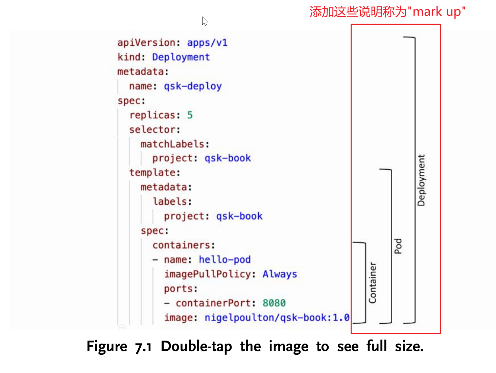

# malfunction

- malfunction: mal-("bad") + function

c/u. a situation in which a system stops working normally(故障)。

- 示例

An operating system that uses protected memory can guard against many kinds of hardware and application errors, so that a complete system failure is not the usual result of each minor mechanical malfunction(《Operating System Concepts》第 511 页)。

# malicious

- malicious: mal-("bad, unplesant")

adj. intended to harm or upset(恶意的)。

- 示例

A program that acts in a clandestine or malicious manner, rather than simply performing its stated function, is called a Trojan horse(《Operating System Concepts》第 625 页)。

# manifest

- **定义**

  c. a document listing a ship's contents, cargo, passengers, and crew, for the use of customs officers.

- **示例**

  You’ll use the deploy.yml manifest in the root of the GitHub repo(《quick start kubernetes》第108页).

  在这里，使用的 manifest 强调这个文件是“a structured document”，" a document that  lists specific items(like deployment setting)"。其实用 file, document 也行。

# manifesto

- **manifestus: manus("hand") + festus"grasp(to quickly take sth)"**

- **manifesto: manifestus + -o(suffix used in Latin nouns)**

"Manifestus" originally conveyed the idea of something being grasped by hand， Over time, the term evolved into "manifesto," which refers to a public declaration of intentions, opinions, or goals—essentially making something clear or evident to others(宣言).

c. a written statement that makes ideas clear and visible to the public.

- **示例**

In 1985, Stallman published the GNU Manifesto, which argues that all software should be free(《Operating System Concepts》第 45 页)。

# mark up 

(1) add markings, annotations to make certain(某些) details clearer or more visible.

之前一直不理解 mark up 想表示的意思，这里补充图片说明。

# marshal

- marshaling

Marshalling or marshaling(US spelling) is the process of transforming the memory representation of an object into a data form suitable for storage or transmission, especially between different runtimes.

- marshaled

The CPython interpreter will evaluate and execute a code object fetched from either the marshaled .pyc file or the compiler(《Python Internals》第151页)。

- marshaling vs serialization

这两个词我在阅读中经常会遇到，它们的区别是什么呢？我还没有搞清楚，现在先mark汇总，后续再做总结。

Marshaling is about getting parameters from here to there, while serialization is about copying structured data to or from a primitive form such as a byte stream. 

# maskable

- mask: masque("a covering for hiding or guarding the face")

- maskable: mask + -able("capable of being")

adj. capable of being masked(hidden or blocked)，可屏蔽的。

- nonmaskable: non- + maskable

示例：Most CPUs have two interrupt request lines. One is the nonmaskable interrupt, which is reserved for events such as unrecoverable memory errors. The second interrupt line is maskable: it can be turned off by the CPU before the execution of critical instruction sequences that must not be interrupted(《Operating System Concepts》第 10 页)。

# masquerade

-  masquerade: maschera("mask") + -ade(suffix that indicating an action or process)

c/u. behavior that is intended to prevent truth from being known(掩饰)；vi. to pretend to be(伪装)。

- 示例

Alternatively, an attacker can take a more active role, either masquerading as one of the parties (referred to as spoofing), or becoming a fully active man-in-the-middle, intercepting and possibly modifying transactions between two peers(《Operating System Concepts》第 636 页)。

# middle vs midst

- middle

s. the central point(中间的)；adj. in the central point(中间的)。

- midst

u/prep. among(在......之中)。

- middle vs midst

之所以有这个疑问是初次查字典的时候，各词典都写着midst 的意思是“u. the middle point”，这让人看着很懵，难懂是一样的意思？其实不是。middle 是真正的“centre, central(中间的)”，而 midst 是“among(在......之中)”，即： Midst means when you are in the area no matter where you are in whether in the middle or around the edge, while in the middle meaning is exactly you are in the center of something which also means you are in between something that equals in the distance!

示例：

1. In the sequence a, b, c, d, e, the middle letter is c.

在上面这个例子中，因为 c 在中间位置，所以用 middle。

2. We never gave up hope in the midst of our troubles(我们在困境中从未放弃希望)。

在上面这个例子中，表示的是 among, 所以用 midst 更合适。

3. If the process was in the midst of updating a file, terminating it may leave that file in an incorrect state()。

# median

c. the value that is the middle one in a set of values arranged in order of size(中位数，中值)。示例：1.假设有一组数 1, 3, 3, 6, 7, 8, 9， 那么 median 是6。2.假设有一组数1, 2, 3, 4, 5, 6, 8, 9，那么 median 是(4+5)/2=4.5。

A benchmark will produce an average/median runtime of a fixed code snippet so that you can compare multiple versions of Python runtime（《CPython Internals》第353页。）

# medium & media

media 是 medium 的复数形式，意思是“介质，媒介”。

# million

- million: mille-("thousand") + -one(augmentative suffix, "large, great")

c. million literally means "a large thousand", "a thousand thousand"(i.e. 1000x1000=1000000, 一百万)。

# moderate

- moderate:  moderatus("within bounds")

adj. neither small nor large(中等的)。

- 示例

A family of *moderate* income.

# monotonic

-  monotonic: mono-("one, single, along") + tonic("relating to tone")

adj. 1. monotonic literally means speaking in such a way that the sounds stays on the same note without going higher or lower(单调的，这里主要指声音方面的)。2. varying in such a way that it either never decreases or never increases. 3. only ever increasing, or only ever getting less(数学上的单调递增或者单调递减的那个“递减”)。

- 示例

The rate-monotonic scheduling algorithm schedules periodic tasks using a static priority policy with preemption(《Operating System Concepts》第 230 页)。

# monotonically

单调地。

# monotonicity

单调性。

# myriad

- myriad: myrias("ten thousand")

c/adj. Originally, myriad referred to the number ten thousand(10,000), but over time, it came to mean a very large or countless number of sth(无数的)。

- 示例

By now, you can probably see that the term operating system covers many roles and functions. That is the case, at least in part, because of the myriad designs and uses of computers(《Operating System Concepts》第5页)。

